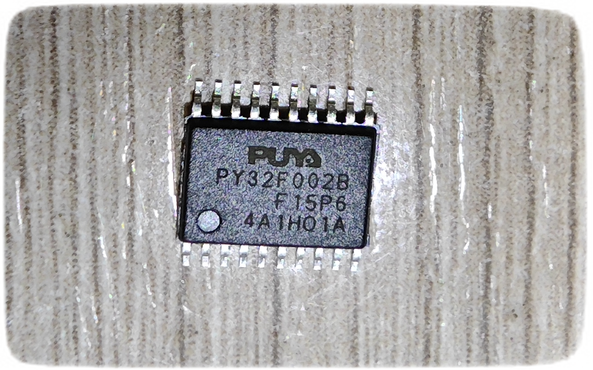

##  Обзор и тестирование семейства контроллеров PY32F002B,L020

### Введение
PY32F002B построены на одном и том же кристалле что и PY32L020.<br>
Отличий не много - для F002B не объявлено: поддержка HSI 48 MHz  и  режим  DeepStop<br>
PY32L020 - нет информации о продажах (только внутри Китая - наверно)<br>
По информации из конфигурационных файлов пакетов к данному семейству относятся также<br>
PY32F002X,PY32F002Z - ещё урезанные 8K/16K - Flash size;

Внутренняя переферия
```
Flash/RAM:  24K/3K 
Max Frequency: 48 MHz
  HSI - 24; 48 MHz (есть калибровочные константы)
  LSI - 32.768kHz (есть калибровочная константа)
  LSE - 0-1000kHz  (not in: qfn16, sop8 )
  HSE - Ext Clock only IN (1-32MHz) (PA6)
OTP: 128 byte
IWDG, SysTick
Timers (16b): Adv:1, GP:1, LP:1, 
1x USART, 1х SPI, 1x I2C
ADC 12bit (8+2ch) (0,75 Msps); 1-2 COMP
Hardware CRC-32 module
Low power modes: Sleep/Stop/DeepStop
User configuration Bootload region and code. (max 4K)
1.7 - 5.5 V

not DMA,RTC,WWDG,Bootloader
```

Дополнительные сведения по серии из [Factory Config](./FactoryConfig/README.md)

### Документация и программы

Информация есть на сайте компании PUYA (только лучше смотреть китайский вариант)<br>
Обновляется довольно часто

Также стараюсь актуальные версии выкладывать в облако
[DOCS - PY32](https://disk.yandex.ru/d/-6DTrL-0xZCn6g/%5B%20ARM%20%5D/PY32)

### Ревизии

Только замечена ревизия - 'A'

### Корпуса (только для  PY32F002B)
```
pinout - только одна версия '1'

qfn20(3x3)  e=0.4   (F002BF15Ux)
tssop20     e=0.65  (F002BF15Px)
sop20       e=1,27  (F002BF15Sx)
qfn16(3x3)  e=0.5   (F002BW15Ux)
sop16       e=1,27  (F002BW15Sx)
sop14       e=1,27  (F002BD15Sx)
sop8        e=1,27  (F002BL15Sx)
```




### Демоплаты
```
1. EmbedFire PY32F002BF15U6TR  ( чип без опозновательных знаков )
   LED1      - Power
   LED2,3,4  - PA1,PA4,PA5
   Key RST   - Reset (PС0)
   KEY1,2    - PA3,PA0
   LSE       - opt (PC1,PB7)
   I/O       - 18 (PA0-7,PB0-7,PC0-1) 
```


### Ремапинг 

Скромный выбор ремапинга функций портов (альтернативные функции)<br>
  (обусловлено небольшим количеством периферии)<br>
Индивидуально можно настроить каждый пин.<br>
Шаблон возможных вариантов ( в разработке )<br>

### Программаторы (Windows 10)

1. ST-Link V2
```
Keil  - работает без проблем
pyocd - ?? в основном работает (кроме режима стирания при Reset или подаче питания) 
```

2. J-Link OB (из BluePill STM32F103)
```
Keil  - работает, только требуется добавить описание контроллеров
        в папку <USER>\AppData\Roaming\SEGGER\JLinkDevices\ 
        распаковать архив  [Puya](./J-Link/Puya.7z)
        ( настройки для F030x6, F030x8, F002B)
Py32CubeProgrammer - работает
pyocd  - ?? совсем не работает и при любой команде убивается клон J-Link 
```

3. CMSIS-DAP  (2 варианта  WCH-LinkE и  SLogic Combo)
```
Keil  - работает, только есть ошибка при стирании чипа, 
        но чип стирается, а заливка не проходит
        если разделить стирание - отдельно, 
        заливка (без стирания) - отдельно
        то всё нормально! 
pyocd  - прошивка, стирание - работает и даже при подаче питания стирать можно        
```

### Утилиты 

1. Py32CubeProgrammer
```
?? работает с J-Link 
через UART нет возможности - нет системной прошивки bootloader-а 
```

2. pyocd
```
для работы с pyocd нужны файл конфигурации и пакет DFP

- загрузка и установка пакета с обновлением
pyocd pack install -u PY32

- пример команды стирания
pyocd erase --target PY32F002Bx5 --chip

- пример команды прошивки (также стирает)
pyocd flash --target PY32F002Bx5 blink.hex 
```

3. openocd - в процессе изучения 

### IDE

1. Keil<br>
    нормально можно работать, учитывая отладчик встроенный<br>
    и поддерживающий разные варианты подключаемых программаторов<br>
2. Eclipse<br>
    при создании проекта статртап файлы не добавляются (может чего не донастроено)<br>
    при настройке вручную - всё работает.
3. IAR -
    В процессе изучения
4. VSCode + PlatformIO -
    В процессе изучения

### Интересные тесты

#### Проверка что это один и тот-же кристалл

в FactoryConfig - есть калибровочная константа для 48 MHz HSI - надо пробовать запустить!